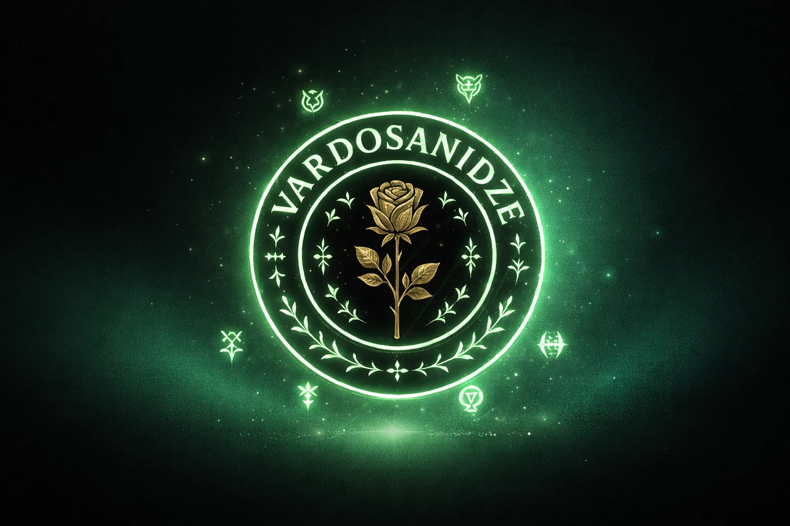

  

  

  
  

Passionate about building <strong>scalable, modern web applications</strong> with clean code and great user experiences. I enjoy solving problems with simple and efficient solutions while continuously learning modern technologies.

For more information about my projects and experience, feel free to visit my portfolio using the button below.

  

  
  Feel free to explore my projects and reach out for collaborations!
  

