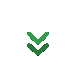

  
<h1 style="border: none; margin: 0; padding: 0;">
  

</h1>

<h2 style="margin-top: 20px; font-weight: 300; border: none; margin: 0; padding: 0;">
  Full Stack Developer |  Web Enthusiast |  Problem Solver

</h2>

  Passionate about building <strong>scalable, modern web applications</strong> with clean code and exceptional user experiences. 
  Constantly learning and exploring cutting-edge technologies.

  

<h3 style="color: #22C55E; margin-top: 30px;">Tech Stack</h3>

&nbsp;&nbsp;&nbsp;
&nbsp;&nbsp;&nbsp;
&nbsp;&nbsp;&nbsp;
&nbsp;&nbsp;&nbsp;
&nbsp;&nbsp;&nbsp;

 
&nbsp;&nbsp;&nbsp;
&nbsp;&nbsp;&nbsp;
&nbsp;&nbsp;&nbsp;
&nbsp;&nbsp;&nbsp;
&nbsp;&nbsp;&nbsp;

<h3 style="color: #22C55E; margin-top: 30px;">Connect With Me</h3>

  
  Feel free to explore my projects and reach out for collaborations!
  

